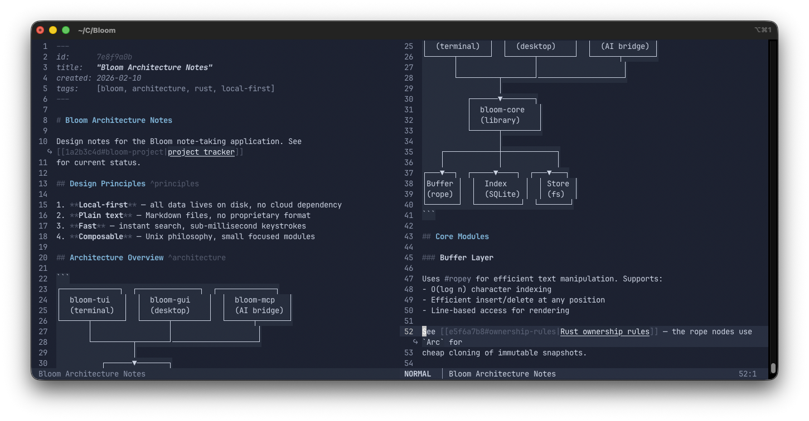

# Bloom 🌱

[](https://hindol.github.io/Bloom/bloom_core/)
[](LICENSE)

> A local-first, Vim-modal note editor for networked thinking.

Bloom is a keyboard-driven note-taking editor built in Rust. Your notes are plain Markdown files on disk, linked with stable UUIDs, indexed with SQLite, and entirely yours — no cloud, no sync, no lock-in. Think Obsidian's linking model with Neovim's editing feel and Doom Emacs' discoverability.



## Features

### Editing
- **Full Vim grammar** — `[count][operator][motion/text-object]` with Normal, Insert, Visual, and Command modes
- **Bloom-specific text objects** — `il`/`al` (links), `i#`/`a#` (tags), `i@`/`a@` (timestamps), `ih`/`ah` (headings)
- **Branching undo tree** — never lose an edit path
- **Word wrap** — visual wrapping with `↪` continuation indicators (on by default, configurable)
- **Inline completion** — `[[` triggers page link picker, `#` triggers tag completion, both anchored at cursor

### Navigation & Search
- **Fuzzy picker** — find pages, search full-text, browse tags, backlinks, and unlinked mentions
- **Full-text search** — FTS5-backed search with line-level results and ±5 line context preview
- **Which-key discoverability** — press `Space` and see what's available
- **Link following** — `[[uuid|display]]` links resolve instantly via index
- **Timeline** — chronological view of all notes linking to a page

### Knowledge Management
- **Bloom Markdown** — standard Markdown extended with `[[wiki-links]]`, `#tags`, `@due(dates)`, and `^block-ids`
- **Daily journal** — one file per day, quick-capture from anywhere with `SPC j a`
- **Agenda view** — overdue / today / upcoming tasks across all pages
- **Templates** — tab-stop navigation, placeholder mirroring, magic variables (`${AUTO}`, `${DATE}`, `${TITLE}`)
- **Refactoring** — split pages, merge pages, move blocks with automatic link updates

### Interface
- **Window splits** — Doom Emacs-style binary splits with resize, swap, rotate, and spatial navigation
- **12 built-in themes** — 6 dark + 6 light with maximum variety (Aurora, Ember, Twilight, Verdant, Sakura, Frost, ...)
- **Adaptive layout** — picker width, preview panels, and column density adapt to terminal dimensions
- **Session restore** — window layout, per-pane buffers, cursor positions, and scroll offsets persist across restarts

### Architecture
- **Event-driven** — `crossbeam::select!` blocks on channels, zero CPU when idle
- **Structured logging** — JSON logs with rotation, `:messages` and `:log` commands for diagnostics
- **Local-only** — zero network calls; optional MCP server for LLM integration
- **Cross-platform** — Windows and macOS (TUI via crossterm)

## Install

### macOS / Linux

```sh
curl -fsSL https://raw.githubusercontent.com/hindol/Bloom/main/install.sh | sh
```

### Windows (PowerShell)

```powershell
irm https://raw.githubusercontent.com/hindol/Bloom/main/install.ps1 | iex
```

### Build from source

Requires [Rust](https://rustup.rs/) 1.75+:

```sh
git clone https://github.com/hindol/Bloom.git
cd Bloom
cargo build --release
./target/release/bloom-tui
```

On first launch Bloom opens a setup wizard to create your vault (default `~/bloom/`).

## Keybindings

| Key | Action |
|-----|--------|
| `i` | Enter Insert mode |
| `Esc` | Back to Normal mode / dismiss notifications |
| `SPC f f` | Find page |
| `SPC j j` | Open today's journal |
| `SPC j a` | Quick-capture a note |
| `SPC s s` | Full-text search |
| `SPC s l` | Backlinks to current page |
| `SPC s t` | Browse tags |
| `SPC l l` | Insert link (inline picker) |
| `SPC w v` | Vertical split |
| `SPC w s` | Horizontal split |
| `SPC T t` | Theme selector (live preview) |
| `SPC n` | New page from template |
| `SPC a a` | Agenda (tasks across vault) |
| `:w` | Save |
| `:q` | Quit |
| `:messages` | Notification history |
| `:log` | Open log file |

See [docs/KEYBINDINGS.md](docs/KEYBINDINGS.md) for the full reference.

## Performance

Benchmarked on a 10,365-page vault (24 MB of Markdown), Windows 11, NVMe SSD:

| Operation | Time | Notes |
|-----------|------|-------|
| First-run full index | **2.4s** | Scan 820ms + read/parse 150ms + SQLite write 1,470ms |
| Incremental startup (0 changed) | **0.7s** | 10K `stat()` calls against fingerprint cache |
| File save → watcher ack | **<1ms** | Fingerprint match, no file I/O |
| Render (idle) | **0 CPU** | Event-driven `crossbeam::select!`, no polling |

## Themes

12 built-in themes, selectable with `SPC T t` (live preview):

**Dark:** Bloom Dark (warm neutral), Aurora (Nordic blue-grey), Ember (charcoal orange glow), Twilight (violet-blue dusk), Verdant (deep forest green), Ink (pure monochrome)

**Light:** Bloom Light (warm neutral), Frost (ice-blue crystalline), Solarium (golden sunlit), Sakura (pink cherry blossom), Lichen (sage green), Paper (pure monochrome)

All themes follow a 16-slot semantic palette (6 roles, 4 surfaces, 2 mid-tones, 4 accents) and are validated against WCAG contrast targets. See [docs/THEMING.md](docs/THEMING.md).

## Configuration

`~/bloom/config.toml`:

```toml
[startup]
mode = "Restore"          # "Journal", "Restore", or "Blank"

[editor]
autosave_debounce_ms = 300
which_key_timeout_ms = 400
scrolloff = 5
word_wrap = true
wrap_indicator = "↪"

[theme]
name = "bloom-dark"
```

## Project Structure

```
crates/
├── bloom-core/          # Core library — editor, vim, index, parser, themes
├── bloom-tui/           # TUI frontend (ratatui + crossterm)
├── bloom-gui/           # GUI frontend (planned)
├── bloom-mcp/           # MCP server for LLM integration
├── bloom-import/        # Logseq vault importer
└── bloom-test-harness/  # Test utilities
```

## Design Documents

| Document | Description |
|----------|-------------|
| [ARCHITECTURE.md](docs/ARCHITECTURE.md) | Threading model, data flow, data safety |
| [KEYBINDINGS.md](docs/KEYBINDINGS.md) | Full keybinding reference |
| [THEMING.md](docs/THEMING.md) | Colour philosophy and palette structure |
| [FILE_FORMAT.md](docs/FILE_FORMAT.md) | Bloom Markdown extensions |
| [WORD_WRAP.md](docs/WORD_WRAP.md) | Frontend-owned wrapping with MeasureWidth trait |
| [DEBUGGABILITY.md](docs/DEBUGGABILITY.md) | Logging, notifications, diagnostics |
| [PICKER_SURFACES.md](docs/PICKER_SURFACES.md) | Picker UI specifications |
| [ADAPTIVE_LAYOUT.md](docs/ADAPTIVE_LAYOUT.md) | Responsive layout breakpoints |

API documentation: [hindol.github.io/Bloom/bloom_core](https://hindol.github.io/Bloom/bloom_core/)

## Contributing

1. Fork the repo and create a branch
2. Make your changes — keep commits small and focused
3. Run `cargo test --workspace && cargo clippy --workspace && cargo fmt --all -- --check`
4. Open a pull request

The design documents in `docs/` are the source of truth for architecture decisions — read them before proposing structural changes.

## Known Bugs

| Bug | Root Cause | Impact |
|-----|-----------|--------|
| Picker composable filters not wired | `PickerFilter` types defined but Ctrl+T/D/L/S not handled | Users can't narrow results by tag/date in pickers |
| No horizontal scrolling | When `word_wrap = false`, long lines truncate at pane edge | Cursor can move past visible area |

## License

Bloom is licensed under the [GNU Affero General Public License v3.0](LICENSE).
