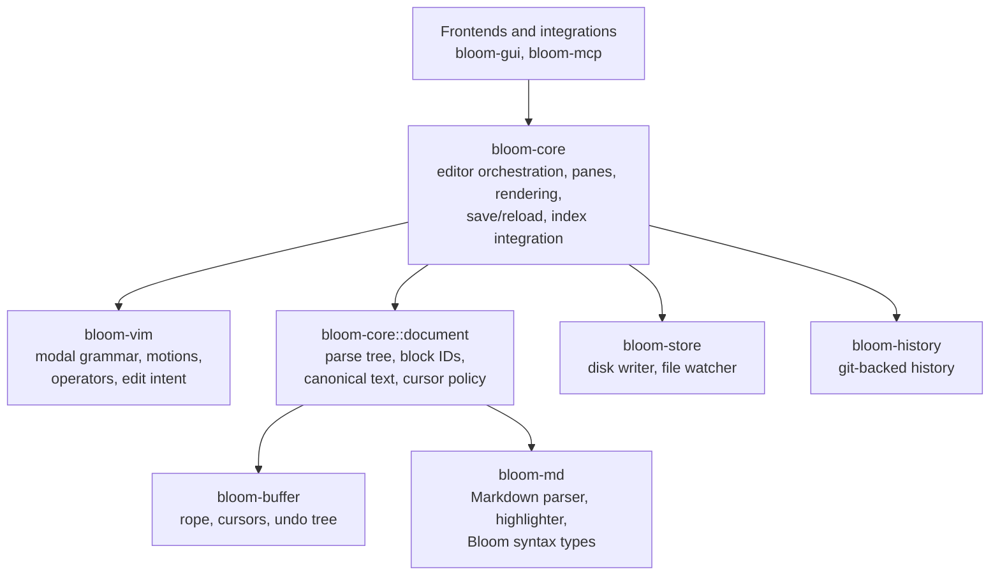
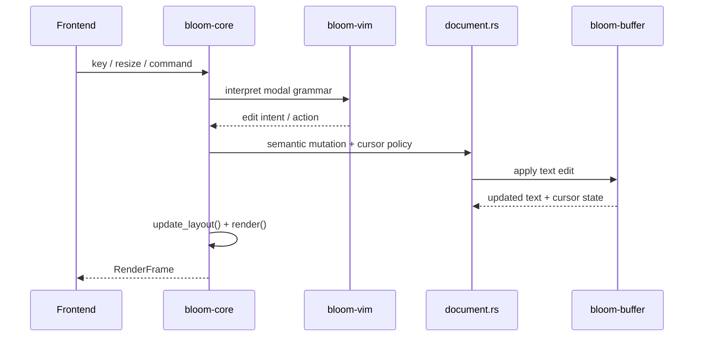
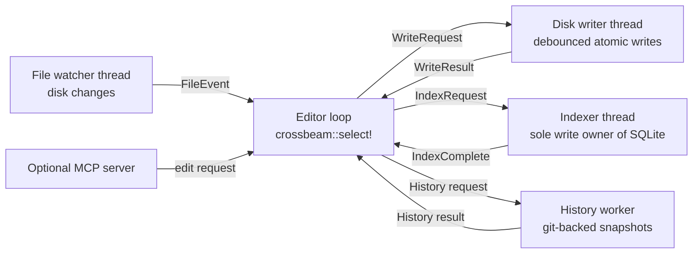

<h1> Bloom Architecture</h1>

> How Bloom stays local-first, responsive, and predictable. For product intent, see [GOALS.md](GOALS.md).

Bloom is organized around a simple question: who owns what? One layer owns text and cursors. One owns Markdown meaning. One orchestrates editor behavior. Frontends render snapshots. Background workers handle slow side effects. The architecture is less about "tiers" than about authority.

That choice buys Bloom something valuable: fewer mystery bugs. If the buffer owns cursors, the save path should not quietly "fix" them. If the document layer owns semantic edits, the frontend should not guess what an align or reload means. Bloom tries to keep those boundaries crisp.

## The System in One Picture

The important seams are these:

- `bloom-buffer` owns mutable text and live cursor state.
- `bloom-md` understands Markdown, but does not own editor state.
- `bloom-core::document` turns rope text into a document model Bloom can reason about.
- `bloom-core` is the conductor. It composes the system, but it does not need to own every detail itself.

## The Three Bets That Shape Bloom

### 1. The Buffer Owns Text and Cursors

`bloom-buffer` is the lowest mutable layer that matters. It owns the rope, tracked cursors, selection state, and undo history.

That sounds mundane until you compare it to how cursor bugs usually happen. In many editors, every subsystem is allowed to patch cursor position after an edit. Bloom tries to avoid that trap. The buffer owns live cursor storage, and low-level text mutation updates tracked cursors as part of the operation.

The result is a sturdier contract:

- text changes happen in one place
- cursor adjustments are part of mutation, not an afterthought
- undo/redo restore cursor state as part of history, not as UI cleanup

### 2. Markdown Semantics Live Above the Rope

A rope knows about characters. Bloom needs to know about headings, hidden block IDs, mirrored structure, canonical on-disk text, and non-local edits such as reload or alignment.

That is why `bloom-core::document` exists. It owns:

- the parse tree for an open document
- hidden block-ID metadata
- canonical disk serialization
- semantic mutation entry points
- cursor policy for operations that are larger than a local text edit

This is one of Bloom's most important architectural seams. The buffer still owns the cursor, but the document layer gets to say what kind of landing an operation wants: preserve, collapse to edit start, collapse to edit end, or reanchor by line and column after a reshape. That is a cleaner model than passing around raw offsets and hoping somebody repairs them later.

### 3. Frontends Render Frames, Not Editor Internals

Bloom's frontends do not interrogate the editor during paint. `bloom-core` produces a `RenderFrame`: a read-only snapshot of everything needed for one frame.

That frame carries:

- pane content and active pane state
- cursor and scroll position
- overlays such as pickers, inline menus, dialogs, and history UI
- layout information
- transient UI state such as notifications and clipboard output

This makes the frontend boundary pleasantly boring. The frontend draws. The editor decides.

## The Edit Path

The path from keypress to new frame is narrow on purpose:

The subtle step is the handoff from `bloom-core` to `document.rs`. Bloom does not want every mutation to look like "replace bytes and pick a number for the cursor." Local inserts, delete operators, reloads, alignment passes, and history restores have different semantics. The document layer exists to make those semantics explicit.

This split also helps Bloom keep user-visible Markdown separate from hidden structural metadata. The editor can present clean text while still preserving canonical on-disk structure.

## Workspace Roles

The workspace makes more sense when grouped by responsibility than by file tree:

| Crate | What it owns |
| --- | --- |
| `bloom-error` | Shared error vocabulary |
| `bloom-buffer` | Rope, cursors, undo tree, low-level edit behavior |
| `bloom-md` | Markdown parsing, highlighting, Bloom syntax types |
| `bloom-vim` | Modal grammar and edit intent |
| `bloom-store` | File-system-facing I/O |
| `bloom-history` | Git-backed history operations |
| `bloom-core` | Editor orchestration, panes, rendering, session state |
| `bloom-gui` | Graphical frontend |
| `bloom-mcp` | Optional local MCP integration |
| `bloom-import` | Import pipeline |
| `bloom-test-harness` | Higher-level editor tests |

The point is not to memorize the table. The point is to notice the pattern: semantic editor state stays near the editor, and side effects are pushed outward.

## The Event Loop and Background Workers

Bloom keeps the main editing state on one thread and pushes slow work out to specialized workers. Channels are the boundary.

The editor loop wakes for a small set of reasons:

- frontend input
- write acknowledgements
- file watcher events
- indexer completion
- history completion
- timer deadlines such as autosave debounce or popup delays

After any wake, Bloom flushes pending timer work, applies the resulting state changes, and renders only if something actually changed.

This design avoids a lot of fake concurrency. The main editing state has one owner. Disk, indexing, and history do their work elsewhere and report back explicitly.

## Safety Rules

Several rules appear again and again in the codebase because they keep the architecture honest.

### Save Should Not Secretly Edit the Buffer

Saving reads from the buffer and writes to disk. If Bloom needs to normalize content or attach metadata, that should happen as an editor operation with normal undo and cursor semantics, not as a surprise in the save path.

### Disk Changes Should Come Back Through One Gate

Self-writes, external edits, sync tools, and branch switches all show up as file events. Bloom prefers that shared path to a pile of one-off "also update this because save just happened" code.

### One Mutation Should Imply One Cursor Story

Undo, redo, reload, align, and local edits should each have an intentional cursor landing. That is why the buffer owns cursor state while the document layer owns higher-level cursor policy.

### Hidden Structure Should Not Leak Into Editing

On disk, Bloom needs canonical structure. In the editor, users should not have to fight implementation detail. The document layer exists to preserve both at once.

## Why It Feels Fast

Bloom is fast mostly because the common path stays short:

- rope edits are cheap
- the editor loop does not block on disk or network
- background work is event-driven
- indexing is incremental
- rendering is snapshot-based

Good editor architecture is often just disciplined subtraction. Keep the hot path small. Keep ownership clear. Make slow work explicit.

## What This Architecture Is Trying to Buy

At its best, Bloom should feel calm. You type, move, search, split panes, follow links, and jump through history without wondering which subsystem is improvising underneath you.

That calm feeling comes from architecture more than from features: buffer truth in one place, document semantics in one place, rendering through frames, side effects through workers, and cursor behavior expressed as policy instead of folklore.

That is the core of Bloom's design.
