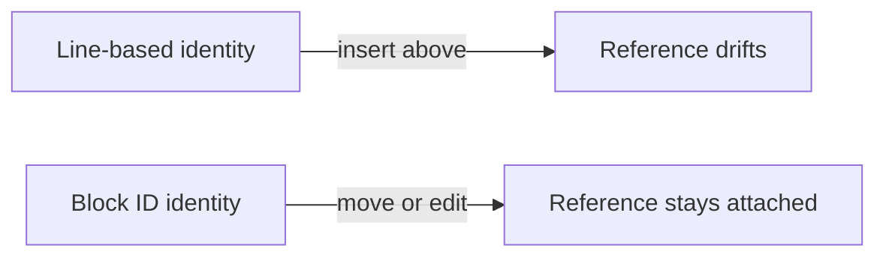
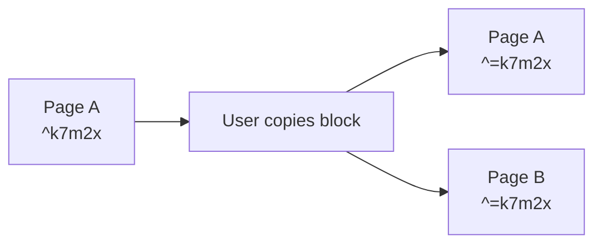

<h1> Bloom Block Identity</h1>

> Stable IDs let Bloom treat blocks as real things instead of brittle line numbers.
> The same ID in multiple pages means the block is mirrored, and Bloom keeps those peers in sync.
> Status: **Implemented.**

---

## Why Block Identity Exists

Plain Markdown gives you text, but not durable identity. A task on line 52 stops being “that task” the moment you insert a few lines above it. Bloom fixes that by giving blocks short IDs that travel with the content.

That one decision unlocks a surprising amount of behavior. History can track a block across edits. Links can point at a block instead of “whatever happens to be near this heading today.” Mirrored content can stay synchronized across pages. Views and future automation can act on a specific block without falling back to fuzzy text matching.



## The Shape of an ID

Bloom uses short base36 IDs such as `^k7m2x`.

| Property | Value |
|----------|-------|
| Alphabet | `a-z0-9` |
| Length | 5 characters |
| Example | `^k7m2x` |
| Scope | Vault-wide |
| Reuse | Never |

Vault-wide identity matters more than page-local identity. If a block moves from one page to another, the ID should move with it. That keeps deep links, history, and mirror relationships intact.

Bloom appends IDs to block content instead of storing them in a separate sidecar. The file stays self-describing, rebuilds are safe, and the on-disk Markdown remains the source of truth.

## Where the ID Lives

The ID sits on the last line of the block so it stays out of the way while you read.

```markdown
- [ ] Review ropey API @due(2026-03-10) ^k7m2x

Some paragraph about buffer design.
Still the same paragraph. ^w1b5q
```

Bloom assigns IDs automatically during indexing. Users do not need to manage them by hand, and Bloom reserves retired IDs so an old link does not accidentally start pointing at unrelated new content later.

## Solo Blocks and Mirrored Blocks

Bloom uses two markers:

```text
^k7m2x   -> this block exists in one place
^=k7m2x  -> this block has peers in other pages
```

The `=` does not mean “copy of the original.” It means “this block participates in a mirror set.” All peers are equal. Edit any one of them and Bloom propagates the edit to the others.



Mirror promotion and demotion are automatic. If the same block ID appears in more than one page with matching content, Bloom promotes the set to `^=`. If a mirror set shrinks back to one survivor, Bloom demotes it to plain `^`.

## How Sync Works

Bloom does not treat mirrors like a background sync problem. It applies edits in memory through the editor's own buffer machinery, so mirrored peers update as part of the same edit flow.

That keeps the behavior predictable. There is no “last write wins” file-watcher race and no separate replica trying to catch up later. The source of truth is still the text in the files, but the propagation path is synchronous enough to feel immediate.

## Type Matters

Mirroring follows the semantic block, not just the raw text. If you turn a mirrored task into a paragraph, Bloom severs the mirror relationship instead of pretending those are still the same kind of thing.

That rule is important because Bloom uses block identity for editor semantics, not merely for storage. A task, a heading, and a paragraph may all be Markdown, but they carry different meaning in navigation, history, and views.

## Section Mirroring

Bloom also supports section mirroring. A heading can act as the anchor for a mirrored section, and Bloom diffs the section's child blocks structurally rather than treating the whole section as one giant opaque string.

In practice that gives you a useful middle ground: mirrors can stay lightweight for single blocks, but the system can also keep repeated sections aligned across pages when that is the right abstraction.

## What Exists Today

The current implementation includes the full basic identity path:

- automatic block IDs
- `^=` parsing, indexing, and highlighting
- mirror promotion and demotion
- edit propagation across mirrored peers
- section mirroring anchored by headings
- retired-ID protection so old references stay safe
- mirror UX commands such as `SPC m m` and `SPC m s`

The important thing is not the marker syntax itself. It is that Bloom can finally treat blocks as durable objects in a Markdown vault that still looks like Markdown when you open it in another editor.
