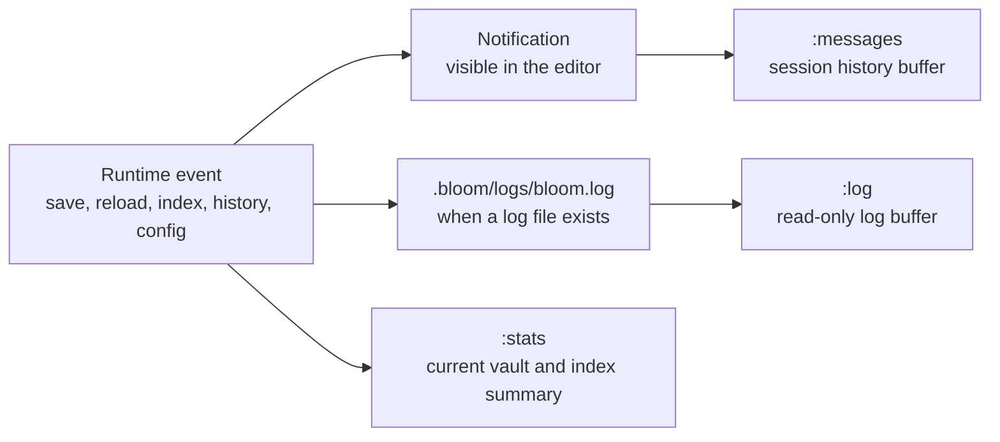

<h1> Bloom Debuggability</h1>

> When Bloom fails, it should say so clearly. Diagnostics should help the user recover, not merely prove that the program was confused.

Bloom's diagnostics story starts in the UI, not in a terminal. If an index rebuild fails, if a file changes unexpectedly, or if Bloom cannot find the current log file, the first job is to surface that fact visibly. Logs matter, but the editor should not require detective work just to admit something went wrong.

## The Diagnostics Surface



There are three user-facing places diagnostics can appear today:

- transient notifications in the editor UI
- the `:messages` history buffer
- the `:log` buffer for the current vault log file

` :stats` belongs here too, even though it is not an error surface. It is the quick "what state is Bloom in right now?" command.

## What Good Diagnostics Feel Like

### Visible First

If something is important enough to log, it is usually important enough to surface in the editor too. The user should not have to guess whether a background worker silently failed.

### Calm, Not Chatty

Bloom should not turn every normal background event into noise. Diagnostics work best when routine success stays quiet and genuinely unusual conditions stand out.

### Recoverable

The point of a diagnostic is not just explanation. It is to help the user decide what to do next: dismiss it, retry, inspect a log, rebuild the index, or keep working.

### Local

Diagnostics should live with the vault. If the vault moves, the logs and the message history workflow should still make sense in that local-first world.

## Notifications

Notifications are Bloom's front line. They are what the user sees while working.

The current behavior is simple and opinionated:

| Level | Lifetime | Meaning |
| --- | --- | --- |
| Info | 4 seconds | Something succeeded or changed state |
| Warning | 8 seconds | Something is odd, degraded, or missing |
| Error | Persistent until dismissed | Something failed and needs attention |

The stack keeps at most 3 visible notifications at a time. If a fourth arrives, Bloom evicts the oldest auto-expiring entry first. If all visible notifications are persistent errors, the oldest one gives way.

That trade-off matters. Notifications should not pile up forever, but important failures also should not disappear before the user can read them.

## `:messages`

` :messages` opens a read-only buffer containing the session's notification history. Bloom records each notification with a wall-clock timestamp and keeps the most recent 100 entries.

That makes `:messages` the right place to answer questions like:

- "What warning just flashed by?"
- "Did the index actually finish rebuilding?"
- "What was the exact wording of that file-change warning?"

This is a good example of Bloom preferring a text-editor-shaped diagnostic tool over a modal popup archive. The history is just another readable buffer.

## `:log`

` :log` opens the current vault log file when one exists:

```text
{vault}/.bloom/logs/bloom.log
```

If the file is missing, Bloom surfaces that as a warning instead of failing silently.

The log buffer is read-only and opens scrolled to the end, which is usually what you want when chasing a recent problem. Bloom also reformats JSON log lines into a more human-readable line-oriented view, so the in-editor log reader feels like a diagnostic tool rather than a raw transport dump.

## `:stats`

` :stats` is not a log viewer, but it belongs in the same mental model. It gives a quick state summary covering things like:

- page, tag, and open-task counts
- whether indexing is in progress
- the most recent index timing breakdown
- the number of open buffers

That makes it a useful "sanity check" command before going deeper into logs or history.

## What This Doc Intentionally Does Not Claim

The older version of this doc read like a full future logging spec: subscriber setup, rotation policy, env-var overrides, and a complete instrumentation plan.

That was too speculative for the new docs surface.

What is safe to say today is narrower and more useful:

- Bloom already uses visible notifications as a real diagnostics surface.
- `:messages`, `:log`, and `:stats` are real commands.
- the log viewer expects a vault-local log file at `.bloom/logs/bloom.log`
- notification history is capped and readable in-editor

If the tracing pipeline evolves further, this doc should describe the actual user-facing result, not an aspirational implementation sketch.

## Practical Debugging Loop

When something looks wrong in Bloom, the intended workflow is:

1. Notice the notification.
2. Open `:messages` if you need the exact wording or missed it.
3. Open `:stats` if the issue smells like indexing, vault state, or background work.
4. Open `:log` if you need more detail and a log file is present.

That loop is deliberately lightweight. Bloom should not require a separate observability stack just to explain normal local failures.

## Related Documents

| Document | Why It Matters Here |
| --- | --- |
| [ARCHITECTURE.md](ARCHITECTURE.md) | Background workers, event loop, and ownership boundaries |
| [HISTORY.md](HISTORY.md) | Recovery and time travel beyond transient diagnostics |
| [SETUP_WIZARD.md](SETUP_WIZARD.md) | First-run flows where diagnostics often matter most |
| [USE_CASES.md](USE_CASES.md) | Acceptance criteria that should eventually cover diagnostic behavior |
