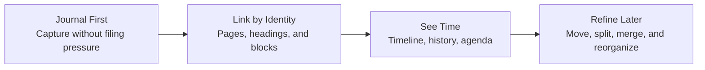

<h1> Bloom Goals</h1>

> What Bloom is trying to be, what it refuses to be, and which promises shape the editor.

Bloom is a local-first note editor for people who think in text, links, and time. The point is not to build yet another note app with every possible surface. The point is to make a small set of ideas feel unusually coherent: write in Markdown, stay on the keyboard, link freely, and let structure emerge without losing control of your files.

## The Shape of Bloom

The editor should make this loop feel natural. Capture first. Organize later. Keep the files yours the whole time.

## Goals at a Glance

| Theme | Goals |
| --- | --- |
| Foundations | G1-G4 |
| Discovery and Context | G5-G6 |
| Editing and Interface | G7-G12 |
| Capture and Import | G13-G16 |
| Automation and Structure | G17-G24 |

## Foundations

### G1 — Local-Only and Private by Default

- Bloom stores notes on your machine, not in a cloud service.
- It should be safe for personal notes, work notes, and sensitive writing.
- By default Bloom makes no network calls. The only exception is the optional MCP integration in G17, which must be explicitly enabled.

### G2 — Markdown with Bloom Extensions

- Notes live as plain Markdown files on disk.
- Bloom adds a few structural extensions - links, block IDs, tags, timestamps, and templates - without turning the format into a database export.
- The deeper format rules live in [FILE_FORMAT.md](FILE_FORMAT.md). This doc is about intent, not syntax trivia.

### G3 — Stable Linking by Identity, Not Filename

- Pages have stable IDs. Headings and blocks can be linked without depending on line numbers or current filenames.
- Renaming a page should not break links. The title changes; the identity does not.
- The frontmatter `title` is the source of truth. Filenames follow from it rather than competing with it.

### G4 — Linking as a First-Class Editing Primitive

- Typing `[[` should feel like opening a door, not invoking a special mode.
- Bloom should make it easy to insert page links, deep links, tags, and timestamps without asking the user to memorize internal IDs.
- Linking is not an add-on feature. It is one of the editor's native gestures.

## Discovery and Context

### G5 — Unlinked Mentions

- Bloom should surface where a page title appears without an explicit link.
- Those mentions are suggestions, not obligations.
- The split matters: explicit links are deliberate structure; unlinked mentions are discovery.

### G6 — Timeline View

- A page should not only show its own text. It should also show where it has mattered over time.
- Bloom's timeline gathers linked notes chronologically without duplicating the source text into a second copy.
- This is one of Bloom's signature views and a big reason the link model matters.

## Editing and Interface

### G7 — Vim-Modal Editing

- Bloom is unapologetically modal.
- Full operator-motion grammar matters more than a superficial "Vim-like" marketing claim.
- The keyboard should remain the primary interface even as Bloom adds higher-level note workflows.

### G8 — Discoverable Command Surfaces

- Power should not require memorizing everything up front.
- The leader-key tree, which-key hints, and searchable command surfaces should make the editor legible while staying fast for experienced users.
- Bloom should feel learnable without becoming click-first.

### G9 — Undo Tree

- Undo should branch. Editing history is not a straight line.
- Undo state should survive long enough to be useful, including across restarts where appropriate.
- For deeper time travel beyond local undo, Bloom pairs this with git-backed history. See [HISTORY.md](HISTORY.md).

### G10 — Cross-Platform Desktop Use

- macOS and Windows are first-class targets.
- Platform-native shortcuts should coexist with modal editing rather than fighting it.
- Cross-platform support is not an afterthought feature; it shapes the architecture.

### G11 — Window Management for Thought, Not Decoration

- Multiple panes should help compare, navigate, and restructure notes.
- Splits are not just for editing two files side by side. They also support timelines, history views, agendas, and other context surfaces.
- Window management should feel spatial and keyboard-native.

### G12 — Structured Search Without a Heavy Query Language

- Search should scale from fuzzy recall to structured filtering.
- Bloom should let users combine text search with filters such as tags, dates, links, and task state.
- The goal is power without making the user learn a second mini-language just to search notes.

## Capture and Import

### G13 — Logseq Import

- Bloom should be easy to adopt from a serious existing notes workflow.
- Logseq import must be one-way and non-destructive: read from Logseq, write into Bloom, never mutate the source vault.
- Import should preserve as much intent as possible, even when exact feature parity does not exist.

### G14 — The Journal as Default Capture Surface

- When you do not know where something belongs, the journal should be the right answer.
- Daily files keep capture simple while still allowing later organization through links and page extraction.
- Quick capture should work without pulling the user out of their current context.

### G15 — Agenda View

- Time-based notes and tasks should be gathered into a single actionable surface.
- Agenda is where timestamps become useful, not just decorative metadata.
- Users should be able to review, reschedule, and complete work from that view without losing the connection to source notes.

### G16 — Universal Fuzzy Picker

- Bloom should have one strong picker model applied across pages, buffers, search, tags, commands, backlinks, and more.
- The picker should support preview, recency, and useful metadata rather than being a thin filename filter.
- It is a navigation system, not just a search box.

## Automation and Structure

### G17 — Opt-In MCP Integration

- Bloom can expose notes to local LLM workflows, but only on purpose.
- MCP should edit through the same editor model as the UI so undo, cursor safety, and live updates still work.
- Local-first remains the default. Automation is allowed, not assumed.

### G18 — Refactoring Operations for Notes

- Links are much more valuable if pages and blocks can be reorganized safely.
- Splitting pages, merging pages, and moving blocks should preserve identity rather than forcing the user to repair references by hand.
- Bloom should make structural editing feel normal.

### G19 — Templates

- Repeated note shapes should be easy to start.
- Templates should support placeholders, tab stops, and a few useful automatic values without turning into a programming language.
- The point is faster beginnings, not a second system to manage.

### G20 — Broken-Link Feedback

- Broken links should be visible, but not noisy.
- Bloom should help the user see what is stale without punishing them for temporary inconsistency.
- The editor should support repair, not shame.

### G21 — Setup Wizard and Vault Structure

- First launch should make the vault shape obvious.
- A Bloom vault should be simple enough to inspect with ordinary file tools.
- Backing up notes should feel like backing up a folder, because that is exactly what it is.

### G22 — Index Rebuild

- The index must be rebuildable from disk state.
- Users should not have to trust opaque internal caches forever.
- Recovery workflows matter because local tools live in the real world of crashes, branch switches, and external edits.

### G23 — Session Restore

- Bloom should remember how you were working, not just what files exist.
- Restoring panes, buffers, cursor positions, and scroll state helps the editor feel continuous instead of stateless.
- This should be configurable rather than mandatory.

### G24 — Full Unicode Support

- Unicode correctness is not polish. It is table stakes for a serious text editor.
- Display width, cursor motion, alignment, search, tags, and filenames should all work with real multilingual text.
- Bloom should not quietly become ASCII-only the moment the note language changes.

## Non-Goals

### NG1 — Cloud Sync

Bloom is not trying to be a hosted notes service. If sync ever appears, it should not turn the product into a cloud dependency.

### NG2 — Mobile Support

Bloom is a desktop editor. The keyboard-first model is the center of gravity.

### NG3 — Plugins in v1

Bloom should have good internal extension seams, but a full user-facing plugin platform is not part of the first release.

### NG4 — WYSIWYG Editing

Bloom is a markup editor with rendering, not a rich-text canvas pretending not to be one.

### NG5 — Collaborative Editing

Bloom is for single-user thinking. Shared real-time editing is outside the product's core shape.

### NG6 — Heavy Rich Media Embedding

Bloom supports image-oriented note workflows, not a full multimedia document studio.

### NG7 — Export as a Primary Workflow

Bloom keeps notes in Markdown. If you need elaborate export pipelines, external tools can handle that.

### NG8 — Graph Visualization

Bloom prefers timelines, backlinks, and context-rich navigation over a node graph that often looks impressive but explains little.

### NG9 — Multiple Vaults in v1

One vault is enough for the first version. Bloom should get that experience right before adding vault switching and cross-vault semantics.

## Related Documents

| Document | Why It Exists |
| --- | --- |
| [ARCHITECTURE.md](ARCHITECTURE.md) | Ownership boundaries, event loop, workers, rendering model |
| [FILE_FORMAT.md](FILE_FORMAT.md) | Bloom Markdown and syntax details |
| [KEYBINDINGS.md](KEYBINDINGS.md) | Keyboard reference |
| [HISTORY.md](HISTORY.md) | Undo tree and git-backed time travel |
| [WINDOW_LAYOUTS.md](WINDOW_LAYOUTS.md) | Pane layouts and spatial navigation |
| [PICKER_SURFACES.md](PICKER_SURFACES.md) | Picker behavior and UI surfaces |
| [USE_CASES.md](USE_CASES.md) | Acceptance criteria across the product surface |
| [SETUP_WIZARD.md](SETUP_WIZARD.md) | First-launch flow and vault setup |
