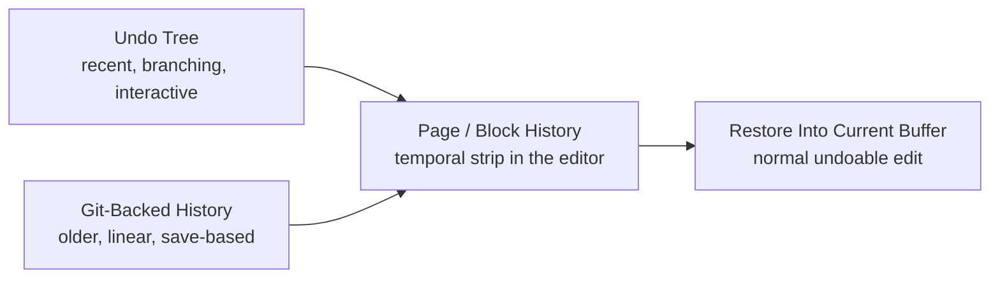

<h1> Bloom History</h1>

> Bloom treats history as part of the editor, not as a backup system that happens to be nearby.

Most note tools are good at the present tense. Bloom also wants to be good at the recent past: what changed in this page, how a block evolved, and what you were looking at a few edits or a few saves ago. That is why history in Bloom has two layers instead of one.

## The History Model

The important idea is that Bloom gives the user one history experience even though two storage models are involved underneath it.

## Two Kinds of Time

| Layer | What It Is Good At |
| --- | --- |
| Undo tree | recent edits, branching recovery, local editing flow |
| Git-backed history | older save-based snapshots, rename-proof page history, longer-term recovery |

The user should not need to think in those terms most of the time. They should mostly think: "take me back a bit" or "show me how this changed."

## What Is Actually Implemented

Current Bloom history surfaces are:

- unified page history via `SPC H h` or `SPC u u`
- block history via the temporal strip
- synthetic block-lineage stops for merge / split explanation inside block history
- explicit checkpoints via `SPC H c`, `:checkpoint`, `:cp`, or `c` inside history
- restore from historical entries back into the current buffer
- optional advanced tracked-block gutter for live identity observability

## Page History

Page history is the broad view: how this page changed over time.

Bloom gathers:

- recent undo-tree states from the live buffer
- older git-backed page history from the history thread

Those entries meet in the temporal strip, with older states to the left and newer ones to the right. That gives Bloom a single editor-native browsing surface instead of making the user jump between an undo UI and an external log.

`SPC u u` opens this same surface. The user does not need to choose between a separate undo-tree visualizer and page history anymore; Bloom merges recent undo states and older durable checkpoints into one history flow.

## Block History

Block history narrows the same idea to the block under the cursor.

That works because Bloom has stable block identity. The editor can track how a specific block changed rather than only how the containing file changed. This is one of the clearest examples of multiple Bloom features paying off together:

- block IDs make the unit stable
- history makes the unit inspectable
- restore turns inspection back into editing

## Restore Behavior

History in Bloom is not read-only archaeology. You can restore what you find.

The key design choice is that restore becomes a normal edit in the current buffer. That means:

- it is visible in the editor immediately
- it participates in undo
- it fits the same editing model as everything else

The history system is therefore not a sidecar. It flows back into normal text editing.

## Explicit Checkpoints

Bloom can also create a durable history stop on demand.

- `SPC H c`
- `:checkpoint`
- `:cp`
- `c` while the history surface is open

An explicit checkpoint first flushes dirty writable pages, then creates one durable checkpoint from the full pending changed set. If nothing new needs to be captured, Bloom says the checkpoint is already current instead of inventing a redundant stop.

## Advanced Live Observability

Bloom also has an optional advanced tracked-block gutter.

When enabled in config (`block_id_gutter = true`), Bloom draws a small read-only marker lane to the left of line numbers. The marker does not try to teach the raw block ID itself. Instead, it signals that Bloom is tracking this block, then briefly flashes when identity changes matter:

- after a split, the preserved block and the new block can flash differently
- after a merge, the surviving block can flash while the retired block's marker disappears

The gutter stays secondary to the main editing flow. It does not replace block history; it only makes current trackedness and recent identity change visible.

## Why Git Lives Under the Hood

Bloom uses git-backed history because it is a strong fit for durable text snapshots, not because it wants users to become git operators.

The practical benefits are straightforward:

- older history stays compact
- page history survives renames because it follows page identity
- Bloom gets a durable longer-term record without inventing a brand-new storage model for everything

That said, the user-facing doc should stop short of drowning in implementation detail. The point is not the specific git tree layout. The point is that Bloom can keep meaningful page history without making filenames the unit of truth.

## What History Is For

Bloom history is there to support three common moods:

### Recovery

You changed something, regret it, and want it back.

### Comparison

You want to see how a page or block evolved, not just revert blindly.

### Confidence

You edit more freely when you trust that the last good version is still nearby.

That last point matters more than it sounds. Good history changes behavior. It makes bolder editing feel safe.

## What This Doc Covers

This doc stays intentionally narrow. It describes the history surfaces that exist in Bloom today:

- page history
- block history
- restore into the current buffer
- the relationship between undo and git-backed history

That is the useful contract with the reader.

## Related Documents

| Document | Why It Matters Here |
| --- | --- |
| [ARCHITECTURE.md](ARCHITECTURE.md) | Event loop, history thread, and ownership boundaries |
| [BLOCK_IDENTITY.md](BLOCK_IDENTITY.md) | Why block history can target something more stable than a line number |
| [JOURNAL.md](JOURNAL.md) | Time-based note navigation from the capture side |
| [USE_CASES.md](USE_CASES.md) | Acceptance criteria for history behavior |
