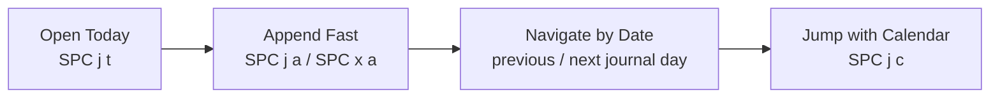

<h1> Bloom Journal</h1>

> The journal is Bloom's default capture surface: one file per day, quick to open, quick to append to, and navigated by time rather than topic.

Bloom treats the journal as the place you write before you know exactly where something belongs. That matters. A lot of notes are born as scraps, tasks, half-decided thoughts, or references you do not want to file correctly on first contact. The journal absorbs that friction.

## The Journal Loop



The journal should feel lighter than page management. Capture first. Sort it out later with links, page extraction, and refactoring.

## What the Journal Is

- one Markdown file per day in `journal/`
- regular Bloom content with links, tags, tasks, and IDs
- navigated primarily by date, not by page title
- available from anywhere through quick capture

That combination is the point. The journal is not a separate mode with a separate file format. It is just the friendliest place to start writing.

## File Shape

Bloom keeps the journal physically simple:

```text
~/bloom/
├── journal/
│   ├── 2026-03-09.md
│   ├── 2026-03-08.md
│   ├── 2026-03-06.md
│   └── ...
├── pages/
└── ...
```

Files are created lazily. Opening today's journal can create the buffer in memory before anything is written to disk. The file appears once normal save or autosave conditions are met.

## Entry Points

| Action | What It Does |
| --- | --- |
| `SPC j t` | Open today's journal |
| `SPC j a` | Quick-append a note to today's journal |
| `SPC x a` | Quick-append a task to today's journal |
| `SPC j j` | Open the journal picker |
| `SPC j c` | Open the journal calendar |

Those commands are deliberately redundant in a good way. Sometimes you want today's page. Sometimes you want a quick append without leaving context. Sometimes you want to browse the journal as a time surface.

## Navigation by Time

The journal is one of the clearest places where Bloom chooses *time* over *filename* as the main organizing principle.

### Today

`SPC j t` opens today's journal and puts Bloom into journal mode for that surface.

### Journal Picker

`SPC j j` opens the journal picker: the same general picker machinery, but scoped to journal entries.

### Calendar Jump

`SPC j c` opens a date picker for jumping directly to a journal day. This is not just a static calendar image in the docs - Bloom really wires the command through `OpenDatePicker(JumpToJournal)`.

### Day-to-Day Navigation

Once you are in journal mode, Bloom tracks the most recently viewed journal date and supports quick temporal navigation from there. The point is to move through writing sessions as sessions, not as filenames in a directory listing.

## Journal Mode

Bloom keeps a lightweight notion of "journal mode" while you are moving through journal time.

That buys two useful behaviors:

- a `JRNL` badge in the status area
- a context strip that appears after journal navigation and auto-hides after a short pause

The strip is a good example of Bloom's preferred UI style. It gives you orientation when you are moving quickly, then gets out of the way.

## Quick Capture

Quick capture is what makes the journal feel like an inbox instead of a special page you have to visit ceremonially.

The important property is not just that you *can* append to today's journal. It is that you can do so without dismantling your current working context first. A thought, task, or link can be dropped into today's page and you can keep going.

That is a small interaction with big consequences. It lowers the cost of capture, and low capture cost is what keeps the journal useful.

## Journal vs Pages

Bloom wants the distinction to be intuitive:

| Surface | Navigate By | Best For |
| --- | --- | --- |
| `pages/` | name and topic | durable ideas, reference pages, structured notes |
| `journal/` | date and sequence | capture, daily work, rough thoughts, task flow |

This is why the journal belongs in the same vault but not in the same mental bucket.

## How It Connects to the Rest of Bloom

The journal is not a cul-de-sac. It connects directly to the rest of the editor:

- links created in journal entries participate in timelines and backlinks
- tasks written in journal pages show up in agenda-style views
- journal pages can be navigated through the picker like the rest of the vault
- journal notes can later be split, linked, or promoted into named pages

The journal is therefore not "temporary writing." It is often the front door to more permanent structure.

## What This Doc Does Not Pretend

The older version tried to freeze every wireframe and every possible interaction in one place. That made the doc longer, but not more trustworthy.

The useful current truth is simpler:

- daily journal files are real
- quick capture is real
- journal picker and calendar jump are real
- journal mode and the auto-hiding context strip are real

That is enough to explain why the journal matters without turning the document into a UX archaeology dig.

## Related Documents

| Document | Why It Matters Here |
| --- | --- |
| [GOALS.md](GOALS.md) | The journal's role in Bloom's product shape |
| [HISTORY.md](HISTORY.md) | Time-based navigation beyond the current day |
| [WINDOW_LAYOUTS.md](WINDOW_LAYOUTS.md) | Where journal-adjacent surfaces sit in the layout model |
| [USE_CASES.md](USE_CASES.md) | Acceptance criteria for journal behavior |
