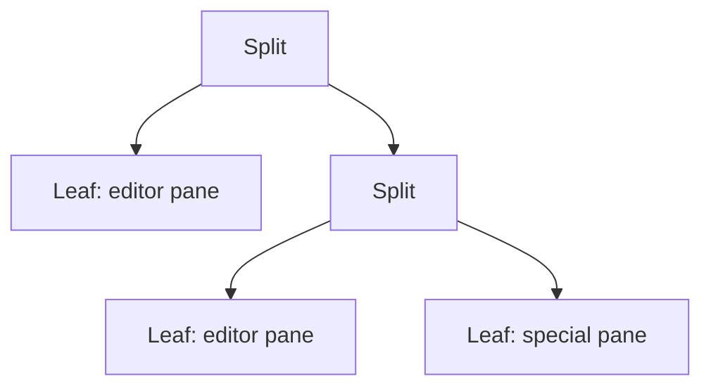

<h1> Bloom Window Layouts</h1>

> Bloom uses a small, editor-first window system: binary splits, spatial navigation, dedicated pane kinds, and layout restore.
> Status: **Implemented.**

---

## The Core Idea

Bloom does not treat panes as floating UI trivia. Layout is part of the editing model. You split the current pane, move through space, swap buffers around, maximize when you want focus, and come back later to the same arrangement.

Under the hood, the layout is a binary split tree. Each split divides one pane into two, either vertically or horizontally. That is a simple model, but it is enough to express the layouts people actually use.

## What a Split Means

Splitting the active editor pane clones its visible state into a new editor pane and gives that new pane its own cursor slot. The result feels close to a classic editor split: same starting context, independent movement after the split.

Bloom supports both directions:

- `SPC w v` — vertical split
- `SPC w s` — horizontal split

Once a layout exists, `SPC w =` balances the ratios back to an even split.

## Navigating Space, Not Tree Order

Pane navigation is spatial. `SPC w h`, `j`, `k`, and `l` move to the nearest pane in that direction rather than cycling through an arbitrary internal list.

That matters because the layout tree is an implementation detail. What users care about is the screen in front of them: “move right to the pane beside me,” not “advance to the next pane ID.” Bloom follows that intuition.

## Resizing, Swapping, and Rotating

Bloom keeps the window commands small and composable:

| Key | Action |
|-----|--------|
| `SPC w >` | Widen the active pane |
| `SPC w <` | Narrow the active pane |
| `SPC w +` | Make the active pane taller |
| `SPC w -` | Make the active pane shorter |
| `SPC w x` | Swap with the sibling pane |
| `SPC w R` | Rotate the parent split |
| `SPC w H/J/K/L` | Move the current buffer into the neighbouring pane |

The interesting distinction is between swapping panes and moving buffers. Swapping changes the structure around the active pane. Moving a buffer keeps the structure but trades which content lives in which position.

## Maximize Without Losing the Layout

`SPC w m` collapses the view to the active pane, but it does not throw the rest of the layout away. Bloom stores the previous tree and restores it when you toggle maximize again.

That makes maximize useful as a working mode rather than a destructive command. You can focus for a while, then return to the exact same split arrangement with the same active pane.

## Special Panes

Not every pane is a normal editor page. Bloom also has dedicated pane kinds for surfaces such as the agenda, timeline, undo tree, page history, and the setup wizard.

Those panes participate in the same layout system, but they are not recursively splittable editor buffers. That boundary keeps the model legible: editor panes are where you split and edit; special panes are purpose-built views that can appear beside the editor when needed.

## The Render Contract

The layout engine computes pane rectangles once per frame and hands concrete areas to the renderer. That keeps layout logic centralized instead of making every drawing routine invent its own geometry.

This is one of those architectural choices that pays off quietly. Features like split navigation, cached rendering, maximized views, and future chrome changes all become easier when there is one authoritative layout pass.

## Persistence

Bloom persists the layout tree as part of session restore. On restart, it rebuilds the pane structure, restores pane state, and puts you back into something that feels like the same workspace rather than a blank editor that happens to know your files.

That is the right mental model for Bloom. A session is not just “open these notes.” It is also “open them in this arrangement, because that arrangement reflects how I was thinking.”

## Window Commands at a Glance

| Key | Action |
|-----|--------|
| `SPC w v` | Split vertically |
| `SPC w s` | Split horizontally |
| `SPC w h/j/k/l` | Navigate left/down/up/right |
| `SPC w d` | Close current pane |
| `SPC w o` | Close other panes |
| `SPC w =` | Balance panes |
| `SPC w m` | Toggle maximize |
| `SPC w x` | Swap with sibling |
| `SPC w R` | Rotate parent split |

Bloom's layout system is intentionally modest. It does not try to be a full tiling window manager inside the editor. It aims for a smaller promise: the pane operations you actually need, expressed clearly, and backed by a layout model simple enough to trust.
