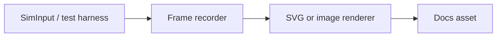

# Animated Documentation Pipeline

> Draft planning note.
> Goal: generate short docs animations from real Bloom sessions instead of recording theme-specific screenshots by hand.

---

## Why This Is Interesting

Bloom already has the hard part: a deterministic test harness that can drive the editor and capture render frames. That makes it plausible to generate animations from real behavior instead of maintaining brittle screen recordings.

The appeal is accuracy. If a feature changes, the animation can change with it. The docs stop depending on someone remembering to rerecord a GIF.

## Proposed Shape

The rough pipeline is straightforward:

1. drive a feature through the existing test harness
2. capture render frames and timing metadata
3. render those frames into a lightweight animation format
4. embed the result in the docs site

## Constraints Worth Preserving

The animation should explain behavior, not lock the docs to one theme or one OS chrome style. That argues for a stripped-down, wireframe-like rendering rather than full screenshots.

The pipeline also needs to stay cheap enough for CI. If generating the animations turns the docs build into a slow media pipeline, the idea stops being attractive.

## Status

This is still future work. The docs site exists, the test harness exists, and the conceptual fit is good, but the frame-recording and rendering pipeline is not wired yet.
